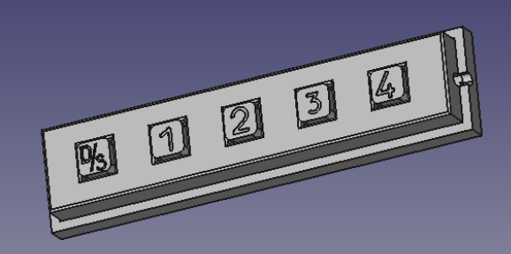
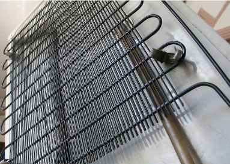
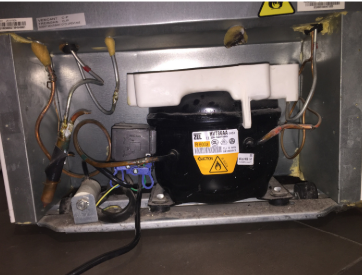
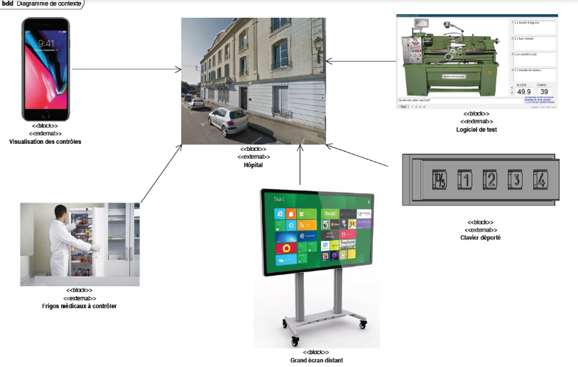

  
# English/Anglais

# PSY Project
Tests and Controls in Psychiatric Hospitals” project

## Area(s) of activity of the project support system :

- IT, networks and infrastructures
- Multimedia, sound and image, radio and television broadcasting
- Measurement, instrumentation and micro-systems

## Analysis of existing situation :

Patients suffering from fronto-temporal degeneration require regular attention and memory training. The preferred activities are games, reading and discussion.

Software is available for MCQ tests, but the absence of a touch screen in patients' homes poses a problem. The use of a computer is difficult due to the age of the patients and their failing eyesight.

Refrigerator breakdowns at the hospital are another problem, requiring prolonged monitoring to detect anomalies.

## Expression of need :

### Overall presentation:

The project comprises two distinct activities:

1. **Development of a Remote Keyboard**: This will enable patients to respond to tests without touching the non-touch screens of family computers or televisions.

2. **Refrigerator Monitoring System**: Measures condenser temperature, compressor interval and detects water leaks near refrigerators.

  

### Specifications :

- Use of USB for the remote keyboard, with the possibility of considering other wireless interfaces.
- Use of Android, Bluetooth and ZigBee for refrigerator monitoring.
  

## Statement of tasks to be carried out by students :

### Student 1:

- Development of the USB link program for the keyboard.
- Consideration of other link interfaces.
- Development of Android application in conjunction with Student 3.

### Student 2:

- Temperature measurement and water detection.
- Programming of ZigBee communication.
- Consideration of sub-assembly power supply.

### Student 3:

- Managing Bluetooth and ZigBee interfaces.
- Record and format data for Android application.
- Ensure proper operation of the communication station.

## Structural description of the system:

### Main components :

- Development boards
- Keyboard enclosure
- Smartphone
- Heating element to simulate fridge condenser

### Hardware and software tools :

- Arduino and Microchip IDE development software
- Simulation and schematic software
- Measurement and soldering equipment
- Arduino documentation

## Constraints :

- Financial constraints: Maintain a reasonable cost with selected distributors.
- Quality constraints: Models must be directly usable and comply with requirements.
- Reliability/safety constraints: Respect electrical safety rules for measurements.

This project aims to meet the specific needs of psychiatric hospitals by proposing appropriate and reliable technological solutions.

   

# Francais/French :

 

# Projet PSY
Projet "Tests et Contrôles en Hôpital Psychiatrique"

## Domaine(s) d'activité(s) du système support du projet :

- Informatique, réseaux et infrastructures
- Multimédia, son et image, radio et télédiffusion
- Mesure, instrumentation et micro systèmes

## Analyse de l’existant :

Les patients atteints de dégénérescence fronto-temporale nécessitent des exercices réguliers d'attention et de mémorisation. Les activités privilégiées sont les jeux, la lecture et la discussion.

Des logiciels existent pour réaliser des tests QCM, mais l'absence d'écran tactile dans les foyers des patients pose problème. Le recours à un ordinateur est difficile en raison de l'âge des patients et de leur vue défaillante.

Les pannes des réfrigérateurs à l'hôpital sont un autre problème, nécessitant une surveillance prolongée pour détecter les anomalies.

## Expression du besoin :

### Présentation globale :

Le projet comprend deux activités distinctes :

1. **Développement d'un Clavier Déporté** : Permettra aux patients de répondre aux tests sans toucher les écrans non tactiles des ordinateurs ou des télévisions familiales.

2. **Système de Surveillance des Réfrigérateurs** : Mesurera la température du condenseur, l'intervalle entre deux compressions et détectera les fuites d'eau près des réfrigérateurs.

 

### Spécifications :

- Utilisation de l'USB pour le clavier déporté, avec possibilité d'envisager d'autres interfaces sans fil.
- Utilisation d'Android, Bluetooth et ZigBee pour la surveillance des réfrigérateurs.

## Énoncé des tâches à réaliser par les étudiants :

### Étudiant 1 :

- Développement du programme de liaison USB pour le clavier.
- Réflexion sur d'autres interfaces de liaison.
- Développement de l'application Android en relation avec l'Étudiant 3.

### Étudiant 2 :

- Mesure de température et détection d'eau.
- Programmation de la communication ZigBee.
- Réflexion sur l'alimentation des sous-ensembles.

### Étudiant 3 :

- Gestion des interfaces Bluetooth et ZigBee.
- Enregistrement et formatage des données pour l'application Android.
- Assurer le bon fonctionnement de la station de communication.

## Description structurelle du système :

### Principaux constituants :

- Cartes de développement
- Boîtier du clavier
- Smartphone
- Élément chauffant pour simuler le condenseur du frigo

### Matériels et outils logiciels :

- Logiciels de développement Arduino et Microchip IDE
- Logiciels de simulation et d'édition de schéma
- Matériel de mesure et de soudure
- Documentation Arduino

## Contraintes :

- Contraintes financières : Maintenir un coût raisonnable avec des distributeurs sélectionnés.
- Contraintes de qualité : Les maquettes doivent être utilisables directement et conformes aux exigences.
- Contraintes de fiabilité/sécurité : Respecter les règles de sécurité électrique pour les mesures.

Ce projet vise à répondre aux besoins spécifiques de l'hôpital psychiatrique en proposant des solutions technologiques adaptées et fiables.
